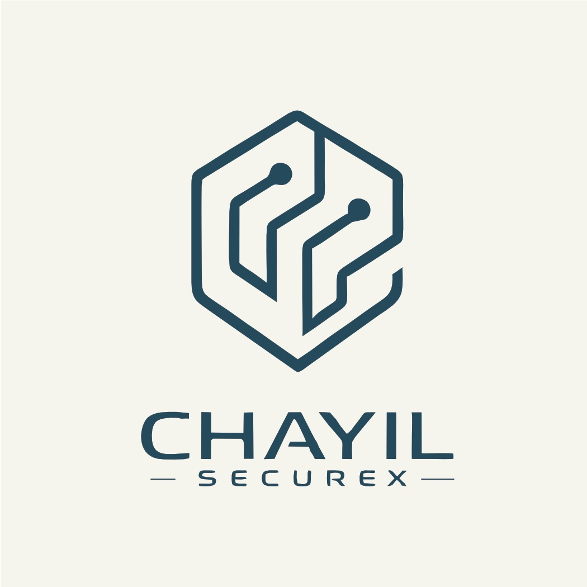
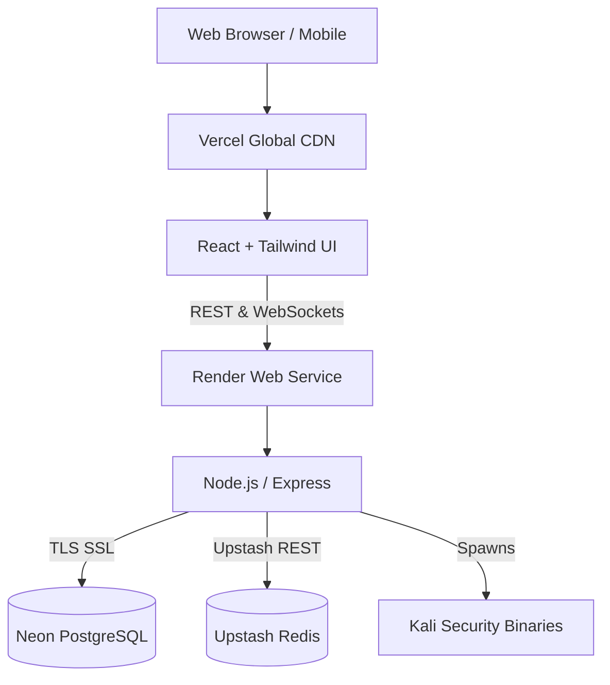

  

<h1 align="center">🔐 Chayil SecureX</h1>

<h3 align="center">Enterprise Cyber Assurance & Intelligence Platform</h3>

  <strong>Africa's Premier Automated Information Security & GRC Orchestration Network</strong> 
  <i>Cyber Assurance · IT Auditing · Active Intelligence · OSINT · Threat Monitoring</i>

  
  
  
  
  

---

## ⚡ Platform Overview

**Chayil SecureX** is a unified, enterprise-grade Cybersecurity and Governance, Risk, and Compliance (GRC) portal. It bridges the gap between proactive threat hunting and board-level risk assurance, providing organizations with real-time visibility into their attack surface, compliance posture, and the global threat landscape.

Engineered with a sleek, minimalist **Glassmorphism UI** and powered by a highly robust Node.js backend to provide instantaneous, real-time threat intelligence.

---

## 🚀 Live Production Domains

- **Backend API (Render):** `https://chayilsecurexenterprise.onrender.com`
- **Frontend Portal (Vercel):** *Deployed via Vercel Edge Network*

---

## 🔥 Key Enterprise Features

### 1. Unified Cyber Assurance Hub
- **CISO Dashboards:** Real-time metrics mapping current threats to business risk.
- **Compliance Tracking:** SOC 2, ISO 27001, and NIST framework alignment matrices.
- **Audit Trails:** Immutable, PostgreSQL-backed logging of all operator actions.

### 2. Live OSINT & Threat Engine
- **Dark Web Intelligence:** Email and IP breach lookups integrated directly into the portal.
- **Domain Fingerprinting:** Deep WHOIS, DNS, and Subdomain reconnaissance.
- **IOC Validation:** Check IPs, Hashes, and URLs against global threat feeds (AbuseIPDB, VirusTotal).

### 3. Integrated Security Binaries
Executes industry-standard security tools natively using local system process spawning:
- `nmap` (Network mapping)
- `nikto` (Web vulnerability scanning)
- `nuclei` (Template-based vulnerability scanning)
- `amass` & `theHarvester` (OSINT gathering)
- `sqlmap` & `whatweb`

---

## 📐 Cloud Architecture

---

## 💻 Tech Stack & Deployment

### Global Cloud Setup
The platform is designed to be fully cloud-native and serverless/PaaS optimized.

1. **Frontend (Vercel)**
   - Framework: React 18 + Vite
   - Styling: Tailwind CSS v3 + Framer Motion (Glassmorphism design language)
   - 3D Rendering: Three.js ambient background elements

2. **Backend (Render Web Service)**
   - Runtime: Node.js 20 (Debian / Kali Linux base for binary support)
   - Architecture: Express REST API + WebSocket Server
   - Background Jobs: BullMQ

3. **Infrastructure Databases**
   - **Neon.tech:** Managed Serverless PostgreSQL (SSL execution).
   - **Upstash:** Managed Serverless Redis for real-time queueing.

---

## 🔑 Operator Access

During the initial database deployment, the system automatically runs the secure seed scripts. Use these operator credentials to initialize your connection:

- **Global Administrator:** `admin@chayilsecurex.com`
- **Security Analyst:** `analyst@chayilsecurex.com`

**Password:** `Admin@2024!` / `Analyst@2024!`
*(Ensure you modify these access keys immediately upon logging into the production environment)*

---

## 🌍 About Chayil SecureX

Based in **Accra, Ghana** — Chayil SecureX delivers world-class information security and assurance services:

- **Cyber Assurance** — Independent control assurance for boards & regulators
- **IT & Security Auditing** — ISO 27001, COBIT, NIST, Ghana NDPA aligned
- **Risk Management** — Enterprise risk registers & treatment planning
- **Compliance Consulting** — Readiness for SOC 2, PCI-DSS, GDPR
- **CISO Advisory** — Virtual CISO & strategic security roadmaps

✉️ **Contact:** [info@chayilsecurex.com](mailto:info@chayilsecurex.com) | 🌐 **Web:** [www.chayilsecurex.com](https://www.chayilsecurex.com)  

---
*© 2026 Chayil SecureX. All rights reserved. Proprietary & Confidential Enterprise System.*
